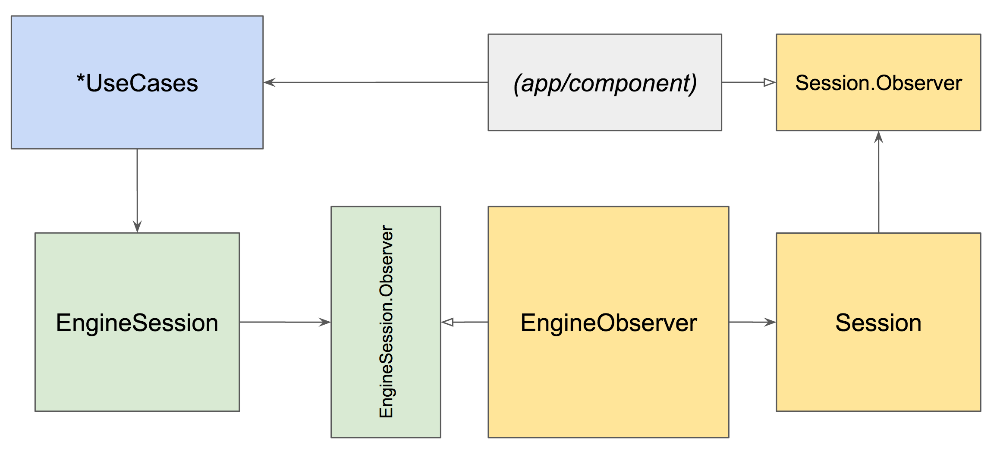
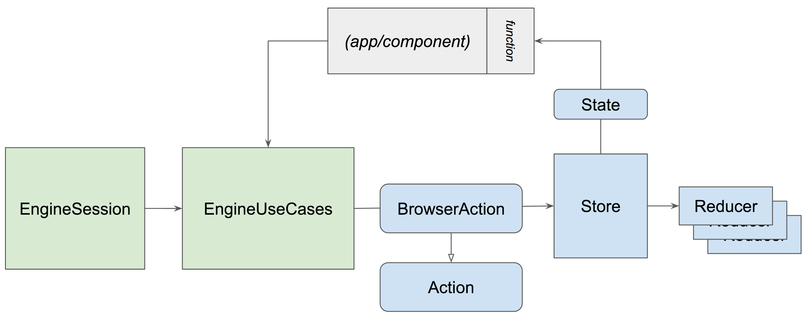

- Feature Name: Browser State - Immutable & Unidirectional
- Start Date: 2018-09-01
- RFC PR: -
- Issue: -

# Summary
[summary]: #summary

Create a new `browser-state` component (starting as a prototype) to eventually replace `browser-session`. `browser-state` will expose an **immutable** and *observable* state. The architecture to create a new state follows a **strict unidirectional data flow**.

# Motivation
[motivation]: #motivation

## Problems with the current implementation of browser-session

* Our current "state" implementation is *mutable* and *observable* at the same time. This can cause observers to see state that has already changed and not match the event they get notified about. See [issue #400](https://github.com/mozilla-mobile/android-components/issues/400) for an example.

* Methods mutating `Session` are visible to consumers - even though they are meant to be called by `EngineObserver` only. This was helpful to migrate apps to `browser-session` without requiring `browser-engine-*`. However for a consumer the following methods are ambiguous. A consumer never wants or should mutate `Session` directly. However application code mostly deals with `Session` instances while linked `EngineSession` objects are mostly hidden.

	```Kotlin
	   Session.trackerBlockingEnabled = true/false
	   
	   EngineSession.enableTrackingProtection()/disableTrackingProtection()
	```

* TODO: https://github.com/mozilla-mobile/android-components/issues/665

* TODO: https://github.com/mozilla-mobile/android-components/issues/876

## Opportunities of the proposed implementation of browser-state

### Single source of truth

All browser (and optionally application) state is stored in an object tree composed of data classes and simple Kotlin data types.
The current state is accessible from a single point ("Store").

### Immutable state

Changes require a new State to be created. This can only be done by the Store and is triggered by dispatching Actions. Actions are instances of plain data classes containing the information required to create a new State.

### Predictable state mutations

With distinct actions and reducers defined, as well as a centralized way of "mutating" state:

* State changes are predictable and do not happen concurrently
* State changes and actions triggering them can be logged to understand how a state was created
* State changes can be debugged centrally

Recording actions and states allows it to:
• Replay state changes for debugging purposes ("Time travelling debugger").
• Enrich crash and bug reports to understand "what happened".

# Guide-level explanation
<!--# Component consumer-level explanation-->
[guide-level-explanation]: #guide-level-explanation

This section explains the proposed change from the *component consumer* side. The example code showing classes and interfaces is simplified for the purpose of explaining the core concepts.

## Data Flow

### Currently: browser-session



In `browser-session` instances of `Session` are mutable and are updated by an `EngineObserver` which implements the callbacks of an engine implementation. Changes of `Session` are propagated as callbacks on `Session.Observer` instances, which are implemented by component and app code.

The engine is instructed from UseCases (e.g. `LoadUrlUseCase`) that often deal with mapping a `Session` to its matching `EngineSession` in order to call methods on it.

Those patterns are not enforced. Mutable `Session` objects can be mutated by any component and app code. Components and apps can access `EngineSession` objects directly and bypass `UseCase` classes completely.

### Proposal: browser-state



In `browser-state` components and apps get access (or subscribe) to a `State` (or `BrowserState`) instance. This instance is immutable and contains the complete state. A state change will always generate a new `State` instance.

State changes (by create a new state) can only be performed by the `Store`. Applications and components that want to trigger a state change dispatch `Action` objects on the `Store`. An `Action` describes a change and contains the required metadata (e.g. `LoadUrlAction`).

`UseCase` classes from the previous architecture can be reused to build and dispatch `Action` objects (reducing boilerplate code).

## State

The `BrowserState` class is a Kotlin [data class](https://kotlinlang.org/docs/reference/data-classes.html) composed of [basic Kotlin types](https://kotlinlang.org/docs/reference/basic-types.html) and other data classes.

A simplified version of this state looks like this:

```Kotlin
data class BrowserState(
    val sessions: List<SessionState>,
    val selectedSessionId: String
)

data class SessionState(
    val url: String,
    val id: String = UUID.randomUUID().toString(),
    val progress: Int = 0,
    val loading: Boolean = false,
    val canGoBack: Boolean = false,
    val canGoForward: Boolean = false,
)
```

All properties of the state class and its subclasses are **immutable**. Whenever the state changes a new state object will be created.

The state class is designed to be as flat as possible. [Extension functions](https://kotlinlang.org/docs/reference/extensions.html) are provided to make navigating and dissecting state easier.

## Store

The `Store` object holds the `BrowserState`. It allows access to the state via a getter method. In addition to that observers can subscribe to state changes in order to receive the latest state whenever it changes.

In addition to holding and making the state accessible the store is the low-level entry point for dispatching `Action` objects that will cause a new state to be created.

A simplified version of the `Store` interface looks like this:

```Kotlin
typealias Observer<S> = (S) -> Unit

interface Store<S> {
    /**
     * Returns the current state.
     */
    fun getState(): S

    /**
     * Registers an observer function that will be invoked whenever the state changes.
     *
     * @param receiveInitialState If true the observer function will be invoked immediately with the current state.
     * @return A subscription object that can be used to unsubscribe from further state changes.
     */
    fun observe(observer: Observer<S>, receiveInitialState: Boolean = true): Subscription<S>

	 /**
	  * Dispatches an action to update the state.
	  */
    fun dispatch(action: Action)
}
```

## Actions

Actions are plain Kotlin [data classes](https://kotlinlang.org/docs/reference/data-classes.html) that contain data in order to create a new state. Actions are send from the application to the store via a `dispatch` method.

A simple action send from the engine to the `Store` to update the URL may look like this:

```Kotlin
data class UpdateUrlAction(
   val url: String
) : Action

// Dispatching an action:
val action = UpdateUrlAction("https://www.mozilla.org")
store.dispatch(action)
```

Once dispatched the store will create a new state with the help of the data inside the `Action` and so called `reducer` functions.

## Extensibility

### Application state

For a "single store" architecture like in a Redux application (as opposed to multiple stores in Flux) and to get some of the advantages mentioned above on an application level it is required to merge the state of the components and the application state to be handled by a single store. Thus the store implementation of `browser-state` uses a generic State class that combines a BrowserState and an optional application state to a single state.

### RxJava and LiveData

In modern Android applications *LiveData*/*ViewModel* (Architecture Components) or *RxJava* is often used for propagating and subscribing to state changes. `browser-state` intentionally doesn't depend on these. Instead extension ‚components (e.g. `browser-state-rx` and `browser-state-lifecycle`) are going to provide the necessary wrapping. Implementing those extension components will depend on the needs of the application teams.

# Reference-level explanation
<!--# Component architecture-level explanation-->
[reference-level-explanation]: #reference-level-explanation

This section explains the proposed change from the *component developer* side.

## Reducers

Reducers are pure Kotlin functions that take a `State` and `Action` as input and return a new `State` as output.

In the case of returning a new state `copy()` of Kotlin data classes is used. This avoids deep copies and only creates new instances of a subset of objects in the state tree.

Reducers are never used directly. The `Store` is responsible for dispatching actions and state to reducers.

## Middleware

A middleware receives an action before it gets dispatched to the reducers. The middleware has three options to proceed:
• Return the same action: Dispatching continues. The next middleware will receive the action and finally it will be passed to the reducers that generate a new state.
• Return a new action: Dispatching will stop and the new action will be dispatched, starting with the first middleware again.
• Return null: Dispatching will stop immediately.

After processing the action and after a new state has been created it will be passed to all middleware instances again.

### Engine integration

In the proposed `browser-state` implementation the engine can be integrated as a middleware:
Specific engine actions ("LoadUrlAction") get processed and either emit a new action (if a state change is desired) or stop the dispatch.

# Drawbacks
[drawbacks]: #drawbacks

...

# Rationale and alternatives
[rationale-and-alternatives]: #rationale-and-alternatives

TODO: ...

# Prior art and resources
[prior-art]: #prior-art

### Frameworks 

* Redux: ..

* Flux: ..

* TODO: ...

### Projects

* Tofino: ...

### Articles

* TODO: Export list from Pocket :)

# Migration path

Replacing `browser-session` with `browser-state` is a larger architectural change that will affect multiple components and consuming apps. Therefore the following "soft" migration path is proposed:

* Implement `browser-state` independently as an "incubator" component.
* Implement an "incubator" browser-sample (including engine middleware prototype) to continue exploring feasibility.
* To avoid changing `browser-engine-*` implementations too early, implement a middleware and action producer based on `Engine.Observer` as a separate component. With that we may be able to use `browser-session` and `browser-state` together in an app for migration purposes.
* Start to migrate feature components from `browser-session` to `browser-state`.
* Finally deprecate `browser-session`.

# Prototype

The following prototype code has been written for this RFC:

  *  [incubator-browser-state](https://github.com/pocmo/android-components/tree/browser-state/components/incubator/browser/state/src/main/java/mozilla/components/browser/session): *browser-state* implementation with state, store, reducers and actions.

* [incubator-samples-state-browser](https://github.com/pocmo/android-components/tree/browser-state/components/incubator/samples/state-browser/src/main/java/org/mozilla/samples/browser): Sample browser with engine middleware using *browser-state*.

# Unresolved questions
[unresolved-questions]: #unresolved-questions

...
